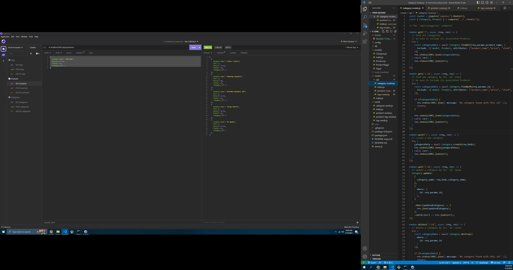

# E-Commerce_Back_End

## Description
In this application, the user will have access to their product data by inputting it into Insomnia.  The information input there will be stored in a database, where the user will be able to quickly reference their team's information. The videos and screenshot below demonstrate this. 

## Table of Contents
- [Installation](#installation)
- [Usage](#usage)
- [Credits](#credits)

## Installation
Programs necessary for usage are Insomnia and Node.js, but dependencies must be added for it to work.  Inquirer, Jest and Express must be installed into the node_modules folder using, "npm install 'program'".  Finally, this must be run using Insomnia, and it cannot be deployed.

## Usage
If one has correctly downloaded the necessary code and has access to what has been written by me, then open Insomnia with localHost 3001.  The user will then be able to perform many different tasks; viewing the products, categories and tags, as well as the stock and price.  The user will also be able to add and delete products using the seed format.

## Screenshot

## Links
Video demo of Application: https://youtu.be/wYepS2jfCQ0
Github: https://github.com/mcalcagno47/E-Commerce_Back_End 

The site: Not applicable in this situation, as it is running locally

## Credits
Mark Calcagno
